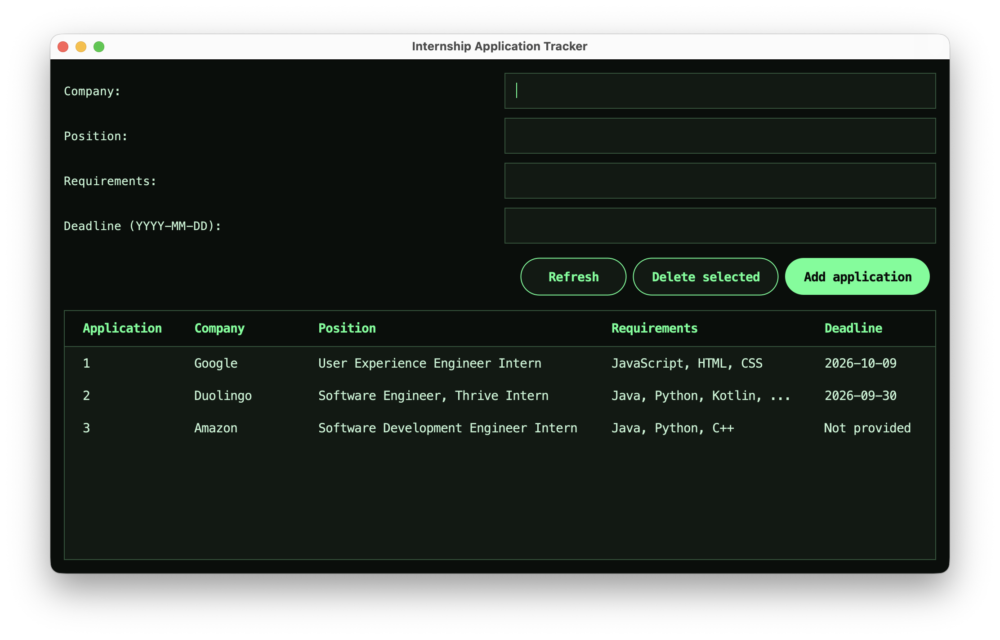

# Internship Application Tracker

I built this project to keep track of internship applications and practice Java and SQL.

It started as a console program. I later added a desktop interface using Java Swing and a dark green theme.

## What it does

- Saves the company name, position, requirements, and application deadline.
- Displays saved applications in a table.
- Lets you delete an application by selecting its row.
- Keeps your data after you close the program using SQLite.

The company and position are required. Requirements and deadline can be left blank. Deleting an application removes it immediately, without confirmation.

## Tools used

Java, Swing, SQLite, and JDBC.

## How to run it

You need JDK 17 or newer and the SQLite JDBC driver.

1. Download `sqlite-jdbc-3.53.4.0.jar` from the [SQLite JDBC releases page](https://github.com/xerial/sqlite-jdbc/releases).
2. Create a folder called `lib` in the project folder and put the JAR inside.
3. Open a terminal in the project folder.

Compile:

```bash
javac AppStyle.java ApplicationTrackerGUI.java
```

Run on macOS or Linux:

```bash
java -cp ".:lib/*" ApplicationTrackerGUI
```

On Windows, use `;` instead of `:` in the classpath.

If Java shows a native-access warning, run with:

```bash
java --enable-native-access=ALL-UNNAMED -cp ".:lib/*" ApplicationTrackerGUI
```

The program creates an `applications.db` file to store your records. This file is not included in the repository.

## What I practiced

- Building forms and tables with Swing
- Handling button clicks and keyboard navigation
- Saving, reading, and deleting data with SQL
- Checking user input
- Using Git and GitHub

## Possible improvements

I would like to add application status tracking, search, and the ability to edit saved applications.

## Screenshot


